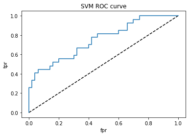

# diabetes-prediction

Process :

<b>1] Visualization </b>

I did Univariate and Bivariate analysis to understand the relationship and based on which I took important features. 

<b>2] Applying algorithms </b>

I applied multiple algorithms and based on the performance on False negatives (as less false negatives are good) I selected Logistic, SVM and Random Forest. 

<b>3] Performance review </b>

Logistic Regression was performing good on both False positves and negatives also did Hyper-parameter tuning to improve the model but the results were same.

SVM and Random Forest both were performing equally good and False negatives were almost same but False positives were reduced. 

If we only talk about False negatives 3 of them were giving nearly same results. 

Confusion matrix for SVM :

ROC Curve for SVM :

Confusion matrix for Random Forest :

ROC Curve for Random Forest :

<b>Important features</b>

